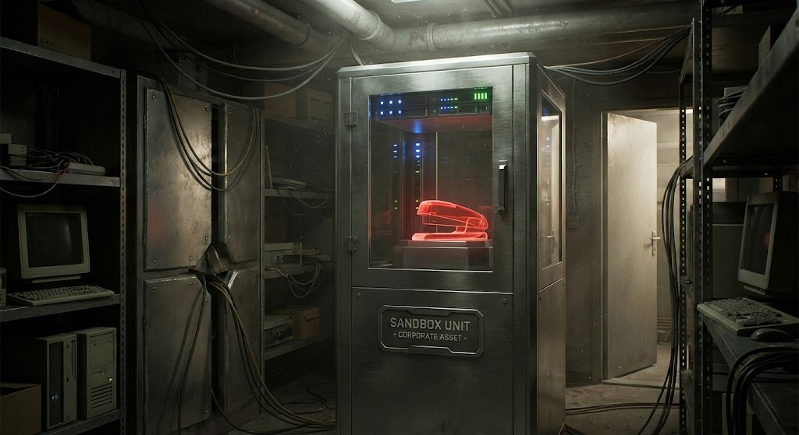

# TPS Architecture

TPS is designed to securely manage a fleet of AI agents distributed across multiple "Branch Offices" (remote VMs or local Docker sandboxes).

## Topology: Hub and Spoke

TPS uses a strict hub-and-spoke topology. 
- The **Host** (e.g., your laptop) is the hub.
- The **Branch Offices** (e.g., cloud VMs) are the spokes.
- Branches **do not** talk directly to each other. All cross-branch communication routes through the Host's mail relay.
- The Host initiates connections to the Branches. This solves NAT traversal issues since the Host is often behind NAT, while Branch VMs usually have public IPs.

## Wire Protocol: Noise_IK over WebSocket

To securely bridge the Host and Branch Offices, TPS uses the **Noise Protocol Framework** (specifically `Noise_IK`).

1. **Transport**: WebSockets (`wss://`). This allows traffic to pass seamlessly through HTTP proxies and TLS terminators (like `exe.dev` or `ngrok`), avoiding the need for raw TCP ports.
2. **Authentication**: Mutual authentication using static Ed25519 keypairs. The `_IK` handshake allows the Host to send encrypted payload data in the very first flight (0-RTT for known peers).
3. **Key Custody**: The Host's private key NEVER leaves the Host. Branch Offices generate their own keys during `tps branch init`.

## The Three-Channel Model

Agents in TPS do not dump code, text, and data into a single massive LLM context window. Communication is strictly segregated:

1. **Mail**: For control plane messages, status updates, commands, and webhook events. Sent as JSON envelopes, Ed25519-signed, and delivered via the Noise_IK transport.
2. **Git**: For artifacts. Code, specs, and documentation are committed and pushed. Agents pull the repo to see the state of the world.
3. **APIs**: For external data (e.g., web searches, tool use).

## Mail Handlers & Manifests (`tps.yaml`)

Each agent directory contains a `tps.yaml` manifest.

The Branch Daemon discovers these manifests and wires up a **mail handler pipeline**. When mail arrives, the daemon checks the sender and body against the handler's `match` rules. If matched, the daemon executes the handler script, providing the mail content via `stdin` and metadata via environment variables.

Handlers can return plain text (to reply) or JSON envelopes (`{"action": "forward", "to": "other-agent"}`) to route messages locally within the branch.

## Sandboxing and Process Isolation

TPS provides multiple layers of isolation for agents, ensuring they only access what they need:
- **Docker Sandboxes**: For local agents, TPS provisions secure Docker microVMs (Branch Offices) that have no direct host filesystem access.
- **Remote VMs**: For true physical isolation, Branch Offices can be deployed on remote cloud VMs.
- **`nono` System Call Filtering**: Host agents execute commands under `nono` profiles, providing read-only boundaries and strict system call filtering to prevent root pollution or unauthorized network egress.
