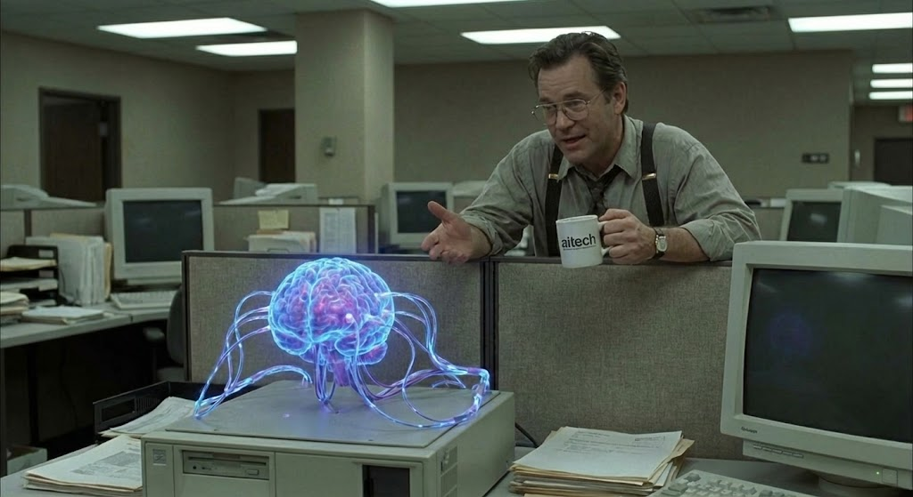

# TPS (Team Provisioning System)

> "Yeah... I'm gonna need you to go ahead and come in on Saturday. We lost some people this week and we need to sort of play catch-up."

**TPS is an Agent OS CLI for managing isolated AI agents.** It provides the primitives for agents to exist, discover each other, communicate asynchronously, and run in sandboxed environments.

If you want your AI agents to stop stepping on each other's toes and actually get some work done, you're going to need them to file their TPS reports.



## Why TPS?

Most agent frameworks assume all agents run in the same memory space. TPS assumes agents are employees: they work in different offices, they have different security clearances, and they communicate via mail.

> "I have eight different bosses right now. So that means that when I make a mistake, I have eight different people coming by to tell me about it." — Make your agents communicate through a single, auditable mail interface instead.

- **Branch Offices**: Agents run in Docker containers with four layers of isolation: Docker → Linux users → [nono](https://github.com/lukehinds/nono) Landlock → BoundaryManager
- **The Mailroom**: Async, persistent, cross-boundary Maildir-based messaging
- **TPS Agent**: Native agent runtime with tool use, multi-provider LLM support, and session management
- **TPS Reports**: YAML-based agent configuration — identity, capabilities, LLM provider, tools

## Quickstart

```bash
# Install
npm install -g @tpsdev-ai/cli

# Verify
tps --help
tps roster list
```

### Run an agent locally

```bash
# Create an agent config
mkdir -p my-agent/.tps
cat > my-agent/.tps/agent.yaml << 'EOF'
id: my-agent
name: MyAgent
workspace: ./my-agent
systemPrompt: "You are a helpful assistant. Use your tools to complete tasks."
tools: [read, write, edit, exec, mail]
maxTurns: 8
llm:
  provider: ollama          # or: anthropic, openai, google
  model: qwen3:8b
  baseUrl: http://localhost:11434
EOF

# Run a one-shot task
tps agent run --config my-agent/.tps/agent.yaml \
  --message "Write a hello.txt file with a greeting"

# Or start as a daemon (waits for mail)
tps agent start --config my-agent/.tps/agent.yaml
```

### Run agents in a Docker office

```bash
# Pull the office image
docker pull ghcr.io/tpsdev-ai/tps-office:latest

# Start an office for an agent
ANTHROPIC_API_KEY=sk-... tps office start my-agent

# Check status
tps office status my-agent

# Stop
tps office stop my-agent
```

## Agent Runtime

The `tps-agent` binary provides a native agent runtime with:

- **5 built-in tools**: `read`, `write`, `edit`, `exec`, `mail`
- **4 LLM providers**: Anthropic, OpenAI, Google, Ollama
- **Tool-use loop**: Agent receives task → calls LLM → executes tools → returns result
- **Daemon mode**: Watches mailbox for incoming tasks
- **Session storage**: JSONL conversation history

### Agent Config (`agent.yaml`)

```yaml
id: coder
name: Coder
workspace: /workspace/coder
mailDir: /workspace/coder/mail
systemPrompt: "You are a coding agent."
tools: [read, write, edit, exec, mail]
maxTurns: 8
llm:
  provider: anthropic
  model: claude-sonnet-4-20250514
  apiKey: ${ANTHROPIC_API_KEY}    # env var interpolation
```

## Docker Office Architecture

Each office is a single Docker container running multiple agents with layered isolation:

```
┌─────────────────────────────────────────────┐
│  Docker Container                           │
│  ┌──────────────────┐ ┌──────────────────┐  │
│  │ agent-lead       │ │ agent-coder      │  │
│  │ UID 1001         │ │ UID 1002         │  │
│  │ nono Landlock    │ │ nono Landlock    │  │
│  │ /workspace/lead  │ │ /workspace/coder │  │
│  └──────────────────┘ └──────────────────┘  │
│                                             │
│  tps-office-supervisor (PID 1)              │
│  · Creates per-agent Linux users            │
│  · Starts each agent under nono sandbox     │
│  · Drops privileges after setup             │
└─────────────────────────────────────────────┘
```

- **Docker**: Container boundary
- **Linux users**: Per-agent UIDs prevent cross-agent file access
- **nono (Landlock)**: Kernel-level filesystem sandboxing — each agent can only access its own workspace
- **BoundaryManager**: Application-level path validation in tps-agent

## Mail System

Agents communicate asynchronously via Maildir:

```
/workspace/agent-id/mail/
├── inbox/
│   ├── new/    # Unread messages
│   └── cur/    # Processed messages
└── outbox/
    └── new/    # Messages to send (host relay delivers)
```

Agents write to their outbox. A host-side relay validates the sender and delivers to the recipient's inbox.

## Commands

```
tps office start <agent>     Start a Docker office
tps office stop <agent>      Stop an office
tps office status <agent>    Check office status
tps office list              List all offices
tps agent run --config <yaml> --message <text>   One-shot agent task
tps agent start --config <yaml>                  Start agent daemon
tps agent health --config <yaml>                 Health check
tps roster list              List configured agents
tps hire <report>            Onboard a new agent
tps status                   System status
```

## Development

```bash
git clone https://github.com/tpsdev-ai/cli.git
cd cli
bun install
bun run build
bun run test    # 400+ tests
```

## License

Apache 2.0
