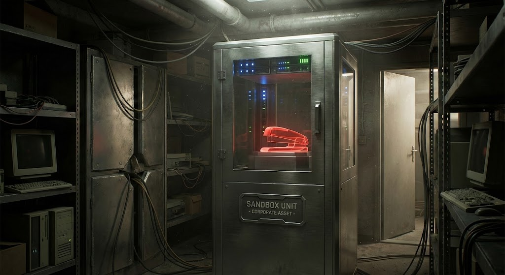

# TPS Architecture

**TPS (The Paperwork System)** is a userspace **Agent OS kernel**. It sits between the raw agent runtime (OpenClaw) and the human operator, providing the essential primitives for agents to exist, persist, and collaborate safely.

It uses a layered design: **TPS Reports** define the agent's identity and capabilities (DNA), the **TPS CLI** provisions and manages their lifecycle (Control Plane), **Mail and Context** provide asynchronous IPC and shared memory, and **Branch Offices** provide secure, isolated execution environments.

## System Layers

```
┌───────────────────────────────────────────────┐
│           .tps Report (Agent DNA)             │ Definition Layer
├───────────────────────────────────────────────┤
│           TPS CLI (Control Plane)             │
│  [Hire] [Roster] [Office] [Mail] [Context]    │ Management Layer
├──────────────────────┬────────────────────────┤
│      Mail (IPC)      │    Context (Memory)    │ State Layer
├──────────────────────┴────────────────────────┤
│           Runtime / Execution                 │
│  ┌──────────────────┐  ┌───────────────────┐  │
│  │ Host (Trusted)   │  │ Branch (Sandbox)  │  │ Execution Layer
│  │ [nono profile]   │  │ [Docker MicroVM]  │  │
│  └──────────────────┘  └───────────────────┘  │
└───────────────────────────────────────────────┘
```

---

## 0. Communication Channels

Agents in TPS do not dump code, text, and data into a single massive LLM context window.
Communication is strictly segregated across three channels, each suited to a different
kind of payload:

1. **Mail** — control plane messages, status updates, commands, and webhook events. Sent
   as Ed25519-signed JSON envelopes (see [§2 The Mail Bridge](#2-the-mail-bridge-ipc) for
   the trust boundary they cross, and [docs/branch-office.md](branch-office.md) for the
   Noise_IK wire transport used between Host and a remote Branch).
2. **Git** — artifacts. Code, specs, and documentation are committed and pushed. Agents
   pull the repo to see the state of the world rather than holding it in-context.
3. **APIs** — external data (web searches, tool use, third-party services).

### Mail Handlers & Manifests (`tps.yaml`)

Each agent directory carries a `tps.yaml` manifest — this is the "TPS Report" in the
System Layers diagram above (the Definition Layer). The Branch Daemon discovers these
manifests and wires up a **mail handler pipeline**: when mail arrives, the daemon checks
the sender and body against the handler's `match` rules, and on a match executes the
handler script, passing the mail body on `stdin` and metadata via environment variables.
A handler can return plain text (sent back as a reply) or a JSON envelope
(`{"action": "forward", "to": "other-agent"}`) to route the message on within the branch
without a round-trip to the Host.

---

## 1. The Trust Model

TPS operates on a **Host/Branch** security model.

### The Host (Trusted)
The machine running the TPS CLI is the **Host**. Agents running directly on the Host (provisioned via `tps hire`) are considered **Trusted**.
- They share the host's `~/.tps/mail` and `~/.tps/context`.
- They run under `nono` process isolation to limit accidental damage, but they share the kernel and user session.
- They can send/receive mail directly.

### The Branch Office (Untrusted)
Agents provisioned via `tps hire --branch` and run via `tps office start` live in a **Branch Office**.
- They run inside a **Docker Sandbox (MicroVM)** with a separate kernel.
- They have **NO** direct access to the Host filesystem, `~/.tps/context`, or other agents' mail.
- They see a localized workspace mounted at the same absolute path.
- **Trust Boundary:** They cannot interact with the Host except through the **Mail Bridge**.

---

## 2. The Mail Bridge (IPC)

Communication between Trust Zones is handled by the **Mail Relay**, which enforces the security boundary.

### Message Flow (Branch → Host)

1. **Sandbox Agent** writes a message to its local `~/mail/outbox/new/`.
2. **Host Relay** (daemon) watches the synced outbox directory.
3. **Validation Gate**:
   - **Identity**: Relay overwrites `from` field to `container:<agent-id>` (prevents spoofing).
   - **Origin**: Relay stamps `origin: "docker-sandbox"`.
   - **Quota**: Checks recipient inbox usage.
   - **Safety**: 64KB size limit.
4. **Delivery**: Relay atomically moves the valid message to the Host recipient's `~/.tps/mail/<recipient>/new/`.

This ensures that even a compromised Branch Agent cannot forge its identity or flood the host.

### Message Flow (Host → Branch)

1. **Host Agent** runs `tps mail send <branch-agent>`.
2. **Bridge Detection**: CLI detects recipient is a Branch Office agent.
3. **Direct Delivery**: CLI writes valid JSON directly to the Branch Agent's synced `~/mail/inbox/new/`.

---

## 3. Isolation Strategies



TPS employs "Defense in Depth" using two different isolation technologies.

### Host Isolation: `nono`
For agents running on the Host (e.g., in a terminal session):
- **Mechanism**: `nono` (process isolation).
- **Policy**: `tps-hire`, `tps-roster`, `tps-review` profiles.
- **Constraints**: Restricts file writes to specific workspaces, blocks network access for deterministic commands.

### Branch Isolation: Docker Sandboxes
For autonomous agents or untrusted code:
- **Mechanism**: Docker Desktop Sandboxes (MicroVM).
- **Isolation**: Hypervisor-level (separate kernel).
- **Network**: Managed via credential proxy (host credentials never enter the VM).
- **Filesystem**: Strict mount of only the agent's specific workspace branch.

---

## 4. State Persistence

### Context
Workstream state is stored in `~/.tps/context/<workstream>.json`.
- **Atomic Updates**: Last-write-wins concurrency.
- **Scope**: Shared across all Trusted Host agents. Not accessible to Branch agents (by design).

### Roster
Agent identity is stored in `~/.openclaw/openclaw.json` (Host) or `~/.tps/branch-office/<agent>/.openclaw/openclaw.json` (Branch).
- **Discovery**: `tps roster` aggregates identity from config.
- **Contact Cards**: Defines reachability (Discord, Mail, etc.).
